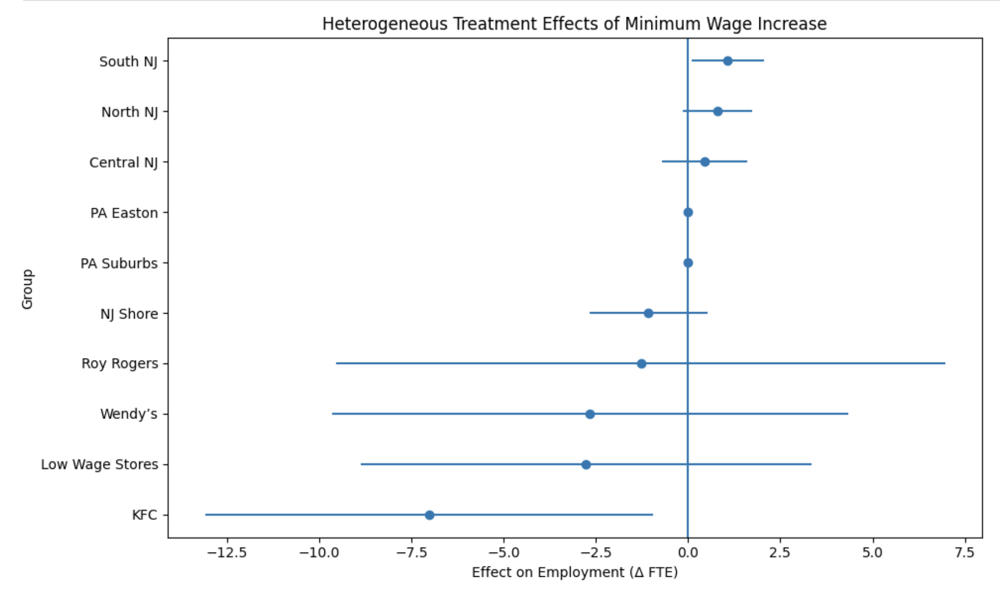

# Econ 5200 Applied Data Analytics in Econ - Midterm Project
This repository contains all the elements for Econ 5200: Applied Data Analytics in Econ midterm project for Spring 2026. 

For this project, I have chosen Track A: The Causal Policy Track (Difference-in-Differences), looking at the option 1 paper: Card, D., & Krueger, A. B. (1994). Minimum Wages and Employment: A Case Study of the Fast-Food Industry in New Jersey and Pennsylvania.

This paper aims to explore the questions of how increasing minimum wage affects employment growth. They did this by comparing fast-food restaurants, where people often work at mimimum wage, between New Jersey and Pennsylvania, both before and after New Jersey implemented an increase in its minimum wage from $4.25 to $5.05 in 1992. They collected this information through surveys both before and after the wage change went into effect. This provides evidence in the policy debate of whether or not to raise minimum wage, due to the potential for it to decrease employment. However this paper found no evidence that an increase in minum wage negatively effected employment.

To extend the original analysis, I implement a heterogeneous treatment effects (HTE) framework to examine whether the impact of the minimum wage increase varies across different types of restaurants. Specifically, I interact the New Jersey treatment indicator with key characteristics already present in the dataset, including initial wage levels, chain affiliation, and geographic location.

The results show that the original finding remains robust—there is still no evidence that the minimum wage increase reduced employment, and estimated effects remain positive. However, the extension provides additional context by showing limited evidence of heterogeneity based on initial wage levels, suggesting the average treatment effect is broadly representative. Some variation emerges across chains, indicating firm-level differences in response, while geographic differences are relatively modest.

Overall, this extension does not weaken the conclusions of the original paper, but rather deepens them by showing that the positive average effect reflects a combination of heterogeneous responses across firms rather than a uniform impact across all establishments.

# Executive Memo 

Raising the minimum wage in New Jersey did not reduce jobs in fast-food restaurants. Even after digging deeper into different types of restaurants, this result still holds.

To understand the methodology, think of this like a real-world A/B test. New Jersey raised its minimum wage, while nearby Pennsylvania did not. Because these states are similar, Pennsylvania acts as a “control group” that shows what likely would have happened in New Jersey if nothing changed. By comparing how employment evolved in both places before and after the policy, we can isolate the true impact of the wage increase, instead of confusing it with broader economic trends.

This chart shows how the employment impact varies across different restaurant types and locations. Each dot is the estimated effect, the lines show uncertainty, and the vertical line at zero means “no change.” Most results sit close to zero and their ranges cross it, meaning there’s no clear evidence of job loss. While a few groups show small positive or negative differences, they are not strong enough to change the main takeaway: the minimum wage increase did not reduce employment overall.

Decision-makers should not assume that modest increases in minimum wage will automatically reduce employment. The evidence suggests businesses can absorb higher wages without cutting jobs, likely through small operational adjustments. However, since some differences appear across restaurant chains, company-specific strategies matter. This means policy changes may not hit every business the same way, but overall job loss should not be the primary concern.

